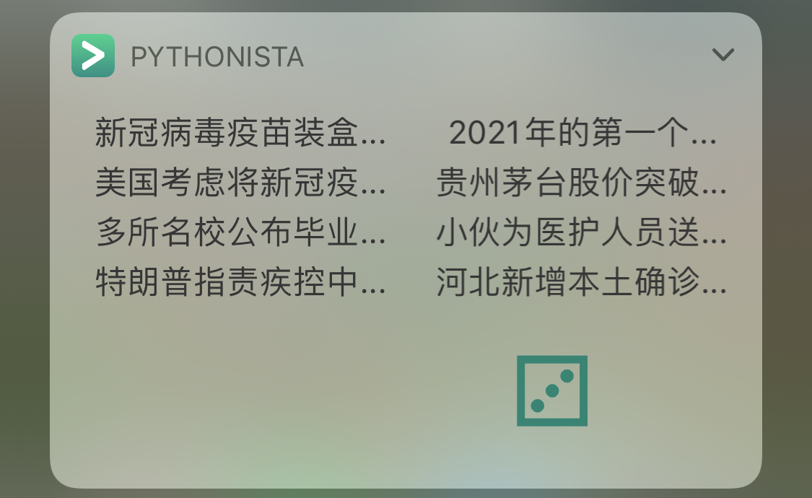

# pythonista 微博要闻榜 iPhone 小组件

## 介绍

通过 iPhone 的 [Pythonsita](http://omz-software.com/pythonista/) 使用 Python 脚本编写的小组件，可以显示微博要闻榜的八个词条以及一个骰子。

点击词条可跳转到微博相应界面。词条的选择采用了随机选取：按序遍历要闻榜，对每个词条有 60% 的可能性显示到小组件中，由此每次打开小组件都会有不一样的词条，而总体上会优先显示热度高的词条。

点击骰子可以随机生成一个点数，选择困难症患者的福音。

## Bug

代码中设置了通过 `ui.get_ui_style()` 来读取系统当前颜色模式，显示文字时根据当前是浅色模式还是深色模式使用不同颜色的文字。直接运行测试没有问题，但在小组件中，总是读取到的结果是浅色模式，导致深色模式下不能正常显示浅色的文字，影响阅读。暂时不知如何解决。